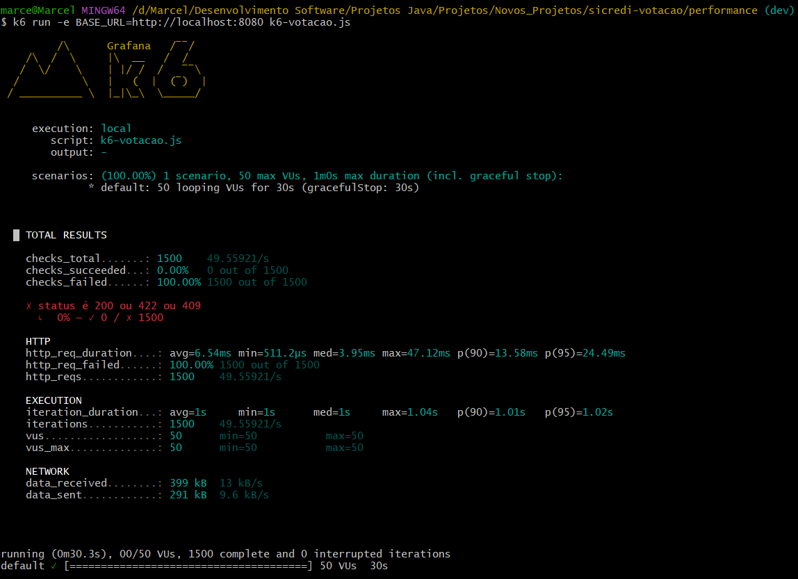

# 📌 API de Votação — Desafio Técnico

## Visão Geral

Este projeto implementa uma **API REST para sistema de votação**, desenvolvida em **Java 21 com Spring Boot**, com foco em **boas práticas de arquitetura**, **containerização**, **observabilidade** e **preparação para execução em nuvem**.

O objetivo principal foi entregar uma aplicação **funcional, bem estruturada e facilmente avaliável**, mantendo decisões técnicas claras e justificadas.

---

## 🏗️ Arquitetura da Aplicação

### Stack Tecnológica

- Java 21
- Spring Boot 3
- Spring Data JPA
- PostgreSQL
- Flyway (versionamento de banco)
- Docker
- AWS (CloudFormation como Infra as Code)

### Organização em Camadas

- **Controller**: exposição dos endpoints REST
- **Service**: regras de negócio
- **Repository**: acesso a dados via JPA
- **DTOs**: isolamento do domínio do contrato da API

Essa separação facilita manutenção, testes e evolução futura.

---

## Decisões Técnicas e Considerações de Performance

### Uso de estruturas de dados orientadas à performance

Durante o desenvolvimento da API, foi evitado o uso de listas (`List`) em pontos
críticos do fluxo de votação, especialmente nas operações de validação e contagem
de votos.

O motivo dessa decisão está relacionado à complexidade de tempo:

- Estruturas baseadas em lista exigem, em muitos cenários, buscas O(n)
- Em cenários de alto volume de votos, isso pode impactar diretamente a performance

Sempre que possível, foram utilizadas estruturas com acesso direto, como mapas
(`Map`), permitindo buscas O(1) e melhor escalabilidade da aplicação.

Essa decisão visa garantir que a API mantenha desempenho previsível mesmo com
crescimento no número de participantes e votos.

---

### Regra de negócio: não exposição de resultado parcial da votação

A API foi projetada para **não permitir a consulta de resultados parciais** de uma
votação em andamento.

O resultado da votação só pode ser consultado **após o encerramento oficial** da
votação.

Essa decisão foi tomada por dois motivos principais:

- **Integridade do processo**: evitar influência no comportamento dos votantes
- **Aderência às regras de negócio**: garantir que todos os votos tenham o mesmo peso
  até o encerramento da votação

Caso uma tentativa de consulta seja realizada antes do término, a API retorna uma
resposta informando que a votação ainda está em andamento.

Essa abordagem assegura consistência, previsibilidade e alinhamento com cenários
reais de sistemas de votação.

---

## ☁️ Estratégia de Nuvem (AWS)

Foi criado um arquivo `infra.yml` utilizando **AWS CloudFormation** com o objetivo de demonstrar domínio em **Infraestrutura como Código**, contendo:

- Amazon ECR
- Amazon ECS (Fargate)
- Application Load Balancer
- Amazon RDS (PostgreSQL)
- AWS Secrets Manager
- CloudWatch Logs
- Security Groups e Subnets

### Observação Importante ao Avaliador

A infraestrutura foi **planejada e iniciada via CloudFormation**, porém tive que interromper o serviço de forma **intencional e estratégica**, para evitar cobranças em minha conta AWS. Devido à complexidade operacional em relação ao tempo disponível do desafio a infraestrutura da nuvem pode não está 100% Otimizada.

Essa decisão priorizou:

- Clareza arquitetural
- Qualidade do código
- Facilidade de avaliação da aplicação

O arquivo `infra.yml` está no projeto como evidência de conhecimento técnico e intenção arquitetural.

---

## 🐳 Execução da Aplicação com Docker (Recomendado)

### Pré-requisitos

- Docker instalado
- Porta 8080 disponível

### 1️⃣ Build da imagem

```bash
docker build -t api-votacao .
```

### 2️⃣ Executar o container

```bash
docker run -p 8080:8080 api-votacao
```

### 3️⃣ Acessar a aplicação

```text
http://localhost:8080
```

### 4️⃣ Health Check

```http
GET /actuator/health
```

Resposta esperada:

```json
{
  "status": "UP"
}
```

---

## 🧪 Banco de Dados

- PostgreSQL
- Flyway executa as migrations automaticamente na inicialização
- Configuração via variáveis de ambiente (12-Factor App)

---

## ⚡ Performance e Escalabilidade

### Decisões Técnicas

- Pool de conexões com **HikariCP**
- Aplicação stateless
- Preparada para escalabilidade horizontal
- Health check pronto para Load Balancer

---

## 🚀 Estratégia de Testes de Performance

Ferramentas utilizada:

- k6

Cenários:

- Criação de sessões de votação
- Votos concorrentes

Execução do teste de performance (k6):

Com a aplicação rodando localmente via Docker, o teste foi executado com:

```bash
k6 run -e BASE_URL=http://localhost:8080 k6-votacao.js
```

Métricas:

- Latência
- Throughput
- Erros
- Consumo de recursos



---

## 📦 Observabilidade

- Logs via SLF4J
- Endpoint `/actuator/health`
- Integração futura com CloudWatch Logs

---

## Testes de API

A aplicação expõe uma API REST documentada via **Swagger**, disponível em:

http://localhost:8080/swagger-ui.html

Além disso, o repositório contém uma **coleção Postman** com exemplos de requisições
para facilitar a validação manual da API sem depender da interface Swagger.

📁 Caminho:
collections/API-VOTAÇÃO-SICRED.postman_collection.json

---

## 🚀 Evoluções Futuras

Embora a aplicação atenda integralmente aos requisitos propostos no desafio,
existem diversas evoluções naturais que poderiam ser implementadas em um
cenário de produção real ou em uma próxima fase do projeto.

### 🔧 Infraestrutura

- **Infraestrutura como Código com Terraform**  
  A infraestrutura poderia ser reimplementada utilizando Terraform,
  permitindo maior portabilidade entre provedores de nuvem e facilitando
  cenários de **multi-cloud** ou **cloud-agnostic**.

- **Separação por ambientes (dev, staging, prod)**  
  Criação de ambientes isolados com diferentes configurações de escala,
  segurança e observabilidade.

- **Auto Scaling baseado em métricas**  
  Configuração de escalabilidade automática com base em CPU, memória
  ou número de requisições, garantindo melhor performance em picos de uso.

### ⚙️ Observabilidade e Confiabilidade

- **Centralização de logs e métricas**  
  Integração com ferramentas como CloudWatch avançado, Prometheus e Grafana
  para métricas de aplicação, banco de dados e infraestrutura.

- **Health checks mais granulares**  
  Separação de health checks de liveness e readiness, especialmente útil
  em cenários com orquestração de containers.

### 🔐 Segurança

- **Rotação automática de secrets**  
  Implementação de rotação automática de credenciais do banco de dados
  utilizando serviços de gerenciamento de segredos.

- **Autenticação e autorização**  
  Inclusão de autenticação via OAuth2 / JWT para proteger endpoints sensíveis,
  especialmente em ambientes públicos.

### 🧪 Testes e Qualidade

- **Testes de carga contínuos**  
  Execução periódica de testes de performance como parte de um pipeline CI/CD,
  garantindo que regressões de performance sejam detectadas rapidamente.

- **Testes de caos (Chaos Engineering)**  
  Simulação de falhas controladas para validar a resiliência da aplicação
  e da infraestrutura.

Essas melhorias não foram implementadas neste momento por não fazerem parte
do escopo do desafio, mas representam caminhos naturais de evolução do sistema.

---

## 🧠 Considerações Finais

Este projeto prioriza:

- Boas práticas de engenharia
- Arquitetura limpa
- Portabilidade
- Clareza para avaliação técnica

A decisão de não finalizar todo o deploy em ECS via CloudFormation foi consciente e estratégica, focando em entregar uma solução sólida, funcional e avaliável.

---

## 📞 Contato

Qualquer dúvida sobre decisões técnicas pode ser esclarecida durante a avaliação.
